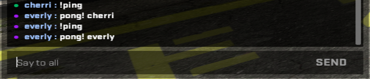
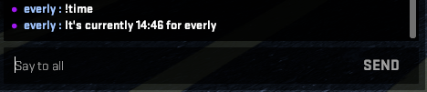
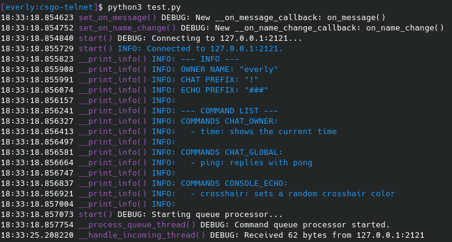

# CSGO Telnet

Little program to use the `-netconport` launch option in CS:GO for chat commands.

# How to use

Set launch option `-netconport PORT`. PORT can be any port you want as long as you change it in your program aswell. 

Example script:
```py
from CSGOTelnet import CommandHandler
from CSGOTelnet import Logger
import time
import random

# Your name is used to check whether a message is from the owner or not
YOUR_NAME = "everly"

# Prefix for the commands in chat
COMMAND_PREFIX = "!"

# Prefix used for commands you echo
ECHO_COMMAND_PREFIX = "###"

# Log level, available options: DEBUG, INFO, WARNING, ERROR
LOG_LEVEL = Logger.LogLevel.DEBUG

# IP and port for the telnet connection
IP = "127.0.0.1"
PORT = 2121

# You can omit the LOG_LEVEL argument and it will default to INFO
handler = CommandHandler.CommandHandler(COMMAND_PREFIX, ECHO_COMMAND_PREFIX, YOUR_NAME, LOG_LEVEL)

# Example on_message handler
def on_message(message):
	print(f"New message from {message.get_author()}: \"{message.get_content()}\"")

# Example on_incoming_data
# This gets called every time the telnet connection reads a line
def on_incoming_data(data):
	decoded = data.decode("utf-8")
	print(f"Incoming: {decoded}")

# Example on_namechange handler
def on_name_change(old_name, new_name):
	print(f"Owner changed name from {old_name} to {new_name}!")

# Example owner-only command, this just sends your local time in chat
def get_time(message, args):
	current_time = time.strftime("%H:%M", time.localtime())
	handler.queue(f"{'say_team' if message.is_team_chat() else 'say'} It's currently {current_time} for {message.get_author()}")

# Example command that can be run by anyone in the game
def ping(message, args):
	handler.queue(f"say pong! {message.get_author()}")

# Example echo command that runs after you echo "###command-name"
#  echo commands are useful for binding a command to a key (bind p "echo ###crosshair")
def crosshair_color(args):
	handler.queue(f"cl_crosshaircolor 5")
	handler.queue(f"cl_crosshaircolor_r {random.randint(0, 255)}")
	handler.queue(f"cl_crosshaircolor_g {random.randint(0, 255)}")
	handler.queue(f"cl_crosshaircolor_b {random.randint(0, 255)}")

# Register incoming data callback
handler.set_on_incoming_data(on_incoming_data)

# Register on message callback
handler.set_on_message(on_message)

# Register the on name change callback
handler.set_on_name_change(on_name_change)

# Add all the commands
handler.commands.add_owner_command("time", "shows the current time", get_time)
handler.commands.add_global_command("ping", "replies with pong", ping)
handler.commands.add_echo_command("crosshair", "sets a random crosshair color", crosshair_color)

# Start the telnet connection and wait for incoming messages
#  anything after this will NOT run because this function will sit in a loop forever
handler.start(IP, PORT)
```

More examples can be found in the `examples` folder.

# Limitations

* Chat parsing only works if CS:GO is in the game's English (Custom languages won't work if you changed the way chat looks). If you set a different langauge, you'll have to change some things in `ChatMessage`
* Chat messages are delayed by 0.7s if the owner is the one executing the command. This makes sure CS:GO doesn't block the message because you're sending messages too fast.
* The program can only read/write to console. If something doesn't show up in console this utility can't react to it.

# TODO

* Get name from Steam using API call, so you don't have to change your name in the code manually.

# Screenshots

These are all results from the example.

### Ping Command


### Time Command


### Terminal Output

