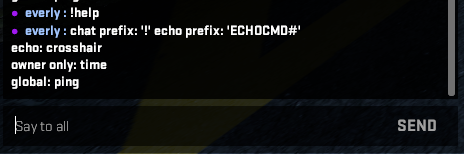

# CSGO Telnet

Little program to use the `-netconport` launch option in CS:GO for chat commands.

# How to use

Set launch option `-netconport PORT`. PORT can be any port you want as long as you change it in your program aswell. 

Example script:
```py
import CSGOTelnet
import random
import time

# Your name is used to check whether a message is from the owner or not
YOUR_NAME = "everly"

# Prefix for the commands in chat
COMMAND_PREFIX = "!"

# Prefix used for commands you echo
ECHO_COMMAND_PREFIX = "ECHOCMD#"

# Enable/disable logging (it's pretty spammy when you enable it)
ENABLE_LOGGING = True

# IP and port for the telnet connection
IP = "127.0.0.1"
PORT = 2121

# Example on_message handler
def on_message(message):
	print(f"Incoming message: {message}")

# Example on_namechange handler
def on_namechange(old_name, new_name):
	print(f"Changed name from {old_name} to {new_name}")

# Example owner-only command, this just sends your local time in chat
def gettime(message, args):
	current_time = time.strftime("%H:%M", time.localtime())
	yield f"{'say_team' if message.is_team_chat else 'say'} It's currently {current_time} for {message.message_author}"

# Example command that can be run by anyone in the game
def ping(message, args):
	yield f"say pong! {message.message_author}"

# Example echo command that runs after you echo "ECHOCMD#command-name"
#  echo commands are useful for binding a command to a key (bind p "echo ECHOCMD#crosshair")
def crosshair_color(args):
	yield f"cl_crosshaircolor 5"
	yield f"cl_crosshaircolor_r {random.randint(0, 255)}"
	yield f"cl_crosshaircolor_g {random.randint(0, 255)}"
	yield f"cl_crosshaircolor_b {random.randint(0, 255)}"

if __name__ == "__main__":
	handler = CSGOTelnet.CommandHandler(COMMAND_PREFIX, ECHO_COMMAND_PREFIX, YOUR_NAME, IP, PORT, ENABLE_LOGGING)
	
	# Register the message callback
	handler.set_message_callback(on_message)

	# Register the namechange callback
	handler.set_namechange_callback(on_namechange)

	# Add all the commands
	handler.add_command("time", "shows the current time", gettime)
	handler.add_global_command("ping", "pong", ping)
	handler.add_echo_command("crosshair", "random crosshair color", crosshair_color)

	# Start the telnet connection and wait for incoming messages
	#  anything after this will NOT run because this function will sit in a loop forever
	handler.start()
```

# Limitations

* Chat parsing only works if CS:GO is in the game's English (Custom languages won't work if you changed the way chat looks). If you set a different langauge, you'll have to change some things in `ChatMessage`
* Chat messages are delayed by 0.7s if the owner is the one executing the command. This makes sure CS:GO doesn't block the message because you're sending messages too fast.
* The program can only read/write to console. If something doesn't show up in console this utility can't react to it.

# Screenshots

These are all results from the example.

### Help Command


### Time Command


### Logging Output

