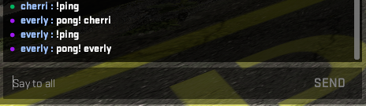
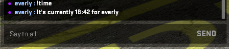

# CSGO Telnet

Little program to use the `-netconport` launch option in CS:GO for chat commands and more.

NOTE: This project isn't really made to be a "download and run" script. You have to know atleast some python to create your own script.

# How to use

First of all, set this launch option for CS:GO: `-netconport 2121`. This can be any port, just make sure to also set the right port in your script. \
Then you can copy an example, or create a new script and do anything fancy you want with it. \
Easiest is to copy `examples/full-example.py` and change that to have the commands and features you want.

# Examples

All examples can be found in the `examples` folder.

* `full-example.py`: This is an example showing most of the functionality in one script.
* `jumpstats.py`: Small programs to save jumpstats to a file using `on_incoming_data()`.
* `moving-clantag.py`: This lets you have a changing clantag in game, so it looks like you're using a cheat.
* `name-from-steamid.py`: This showcases the `set_name_from_steamid()` function.

To run an example, copy it to the project's root directory and run it with python.

# Limitations

* Chat parsing only works if CS:GO is in the game's English (Custom languages won't work if you changed the way chat looks). If you set a different langauge, you'll have to change some things in `ChatMessage`
* Chat messages are delayed by 0.7s if the owner is the one executing the command. This makes sure CS:GO doesn't block the message because you're sending messages too fast.
* The program can only read/write to console. If something doesn't show up in console this utility can't react to it.

# Screenshots

These are all results from `examples/full-example.py`.

### Ping Command

### Time Command

### Terminal Output

